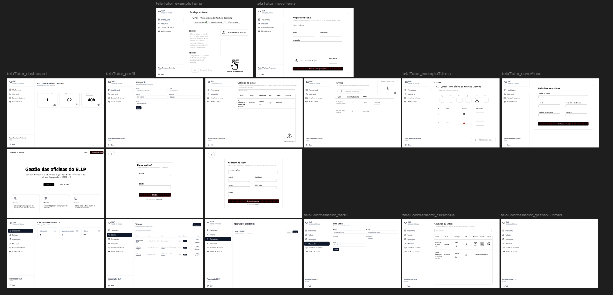

<h1 align="center">Certificadora de Competência Identitária - ELLP [Gestão de Oficinas]</h1>

<p align="center">
Repositório que unifica o front-end e o back-end da plataforma de gestão de oficinas do projeto de extensão ELLP (Ensino Lúdico de Programação) da UTFPR-CP.
</p>

<div align="center">
  <figure>
    
    <figcaption>Protótipo do website feito com o Figma</figcaption>
  </figure>
</div>

<br>

# Integrantes do grupo

<markdown-accessiblity-table data-catalyst="">
<table tabindex="0">
  <thead>
    <tr>
      <th align="center"><a href="https://github.com/Luis-Spessoto"><br><sub>Luís Felipe Spessoto</sub></a></th>
      <th align="center"><a href="https://github.com/BrunoBiazon"><br><sub>Bruno Circhia Biazon</sub></a></th>
      <th align="center"><a href="https://github.com/JoaoVFB"><br><sub>João Vitor Furquim</sub></a></th>
      <th align="center"><a href="https://github.com/DaniloFrazon"><br><sub>Danilo Augusto</sub></a></th>
      <th align="center"><a href="https://github.com/Pedro-Meloo"><br><sub>Pedro Henrique</sub></a></th>
    </tr>
  </thead>
</table>
</markdown-accessiblity-table>

# Descrição do projeto

O sistema para gestão de oficinas do ELLP é uma plataforma Fullstack desenvolvida para centralizar e automatizar a gestão das oficinas do projeto de extensão ELLP (Ensino Lúdico de Programação) da UTFPR-CP. A aplicação substitui controles manuais, possibilitando o gerenciamento organizado de tutores, professores, alunos, turmas e oficinas. O sistema permite que os responsáveis pelo projeto realizem o acompanhamento das atividades, organização das turmas e controle das informações relacionadas às oficinas.

# Tecnologias utilizadas

### Front-end
- TypeScript
- React
- HTML5
- CSS3

### Back-end
- Node.js
- Express
- MongoDB (Mongoose)

### Ferramentas utilizadas
- Visual Studio Code
- GitHub
- Figma

# Divisão Laboral

- **Luís**: Responsável pela Prototipagem, UI/UX e Scrum Master
- **João**: Responsável pelo Módulo de Professores e Tutores
- **Danilo**: Responsável pelo Módulo de Temas e Curadoria de Oficinas
- **Pedro**: Responsável pelo Módulo de Alunos e Enturmação
- **Bruno**: Responsável pelo Backend e Integração

# Funcionalidades Desenvolvidas

### Gestão de Usuários
- Cadastro e gerenciamento de usuários do sistema
- Controle de acesso conforme perfil

### Gestão de Professores e Tutores
- Cadastro de professores
- Cadastro de tutores
- Visualização e gerenciamento das informações

### Gestão de Alunos
- Cadastro de alunos
- Organização de alunos em turmas
- Controle de participantes das oficinas

### Gestão de Oficinas
- Cadastro de oficinas
- Organização dos temas trabalhados
- Curadoria das atividades disponíveis

### Gestão de Turmas
- Criação e gerenciamento de turmas
- Associação de alunos e tutores

__________________________________________

# Estrutura do Repositório

O projeto é dividido em dois diretórios principais:

### 📁 `/frontend`
Interface web moderna desenvolvida com React, TypeScript, Vite e estilizada com componentes customizados baseados em shadcn/ui.

* **`src/components/`**: Componentes reutilizáveis da interface de usuário.
    * `layout/`: Layouts estruturais da aplicação (como o `AppShell.tsx`).
    * `ui/`: Componentes básicos de design system (botões, modais, tabelas, inputs, etc., configurados com Tailwind CSS).
* **`src/contexts/`**: Provedores de estado global do React.
    * `AuthContext.tsx`: Contexto global para controle e persistência de autenticação do usuário.
* **`src/hooks/`**: Hooks customizados do React (como `use-mobile.tsx` para detecção de dispositivos móveis).
* **`src/lib/`**: Configurações de bibliotecas externas e utilitários helpers (ex: `utils.ts` e helpers de captura de erros).
* **`src/modules/`**: Módulos de negócio divididos por domínio (cada um contendo seus próprios componentes internos, serviços e tipagens):
    * `alunos/`
    * `professores/`
    * `temas/`
    * `tutores/`
* **`src/routes/`**: Gerenciamento de rotas com roteamento baseado em arquivos utilizando TanStack Router.
    * `_authenticated/`: Subgrupo de rotas protegidas que necessitam de login ativo (como dashboards, perfil e listagens de entidades).
    * `index.tsx`, `login.tsx`, `cadastro.tsx` e `__root.tsx` (a rota raiz que encapsula a estrutura global).
* **`src/services/`**: Camada de comunicação de rede e chamadas de API (como `apiClient.ts` e `authService.ts`).
* **`src/styles.css`**: Estilos globais e tokens de design CSS da aplicação.

---

### 📁 `/backend`
API RESTful robusta desenvolvida com Node.js, Express, Mongoose e MongoDB, estruturada seguindo o padrão MVC (Model-View-Controller):

* **`src/config/`**: Configurações de conexões externas.
    * `db.js`: Inicialização e conexão com o banco de dados MongoDB.
* **`src/models/`**: Definições dos schemas das entidades Mongoose e seus relacionamentos:
    * `Aluno.js`: Representação da entidade Aluno.
    * `Oficina.js`: Representação da entidade Oficina.
    * `Professor.js`: Representação da entidade Professor.
    * `Tema.js`: Representação da entidade Tema.
    * `Turma.js`: Representação da entidade Turma.
    * `Tutor.js`: Representação da entidade Tutor.
* **`src/controllers/`**: Lógica de negócio das rotas da API:
    * `alunoController.js`, `authController.js`, `oficinaController.js`, `professorController.js`, `temaController.js`, `turmaController.js`, `tutorController.js`.
* **`src/routes/`**: Definição de endpoints Express e o mapeamento das requisições para seus respectivos controladores:
    * Rotas individuais correspondentes a cada módulo do sistema unificadas no arquivo centralizador `index.js`.
* **`src/middlewares/`**: Funções intermediárias que atuam no pipeline de requisições:
    * `authMiddleware.js`: Interceptação e validação de tokens JWT para rotas privadas.
    * `errorHandler.js`: Middleware de tratamento centralizado de erros e exceções da API.
* **`src/utils/`**: Utilitários gerais de suporte para a API:
    * `asyncHandler.js`: Wrapper assíncrono para rotas do Express para simplificar o tratamento de erros sem blocos try-catch manuais repetitivos.
* **`src/docs/`**: Estruturação da documentação da API baseada em OpenAPI/Swagger:
    * `swaggerConfig.js`: Configuração geral do Swagger UI.
    * Subdiretórios `paths/`, `responses/`, `schemas/` e `tags/` para modularização da documentação dos endpoints.
* **`src/app.js`**: Configura a instância principal da aplicação Express.
* **`src/server.js`**: Script de entrada principal que inicializa o servidor HTTP e escuta a porta de rede.

# Como Executar o Projeto

Certifique-se de ter o Node.js instalado na sua máquina e o MongoDB rodando localmente (ou uma URI de banco configurada no arquivo `.env` do backend).

### 1. Instale as dependências

Execute `npm install` dentro das respectivas pastas (`/frontend` e `/backend`).

### 2. Configure o arquivo `.env`

Crie um arquivo `.env` na raiz do backend com o seguinte exemplo:

```env
PORT=3000
MONGO_URI=mongodb://localhost:27017/oficinas-gestao
JWT_SECRET=secreto
```

### 3. Inicie os servidores

A partir do diretório raiz do projeto, utilize os seguintes comandos em terminais separados:

```bash
npm run dev:backend
```

```bash
npm run dev:frontend
```

*(Lembre-se de rodar estes comandos em terminais separados para manter ambos em execução ao mesmo tempo).*

# Documentação da API ( Swagger ) 

A API possui documentação interativa, disponível localmente em dois formatos:

- **Swagger**: inicie o back-end (`npm run dev:backend`) e acesse `http://localhost:3000/api-docs`.

